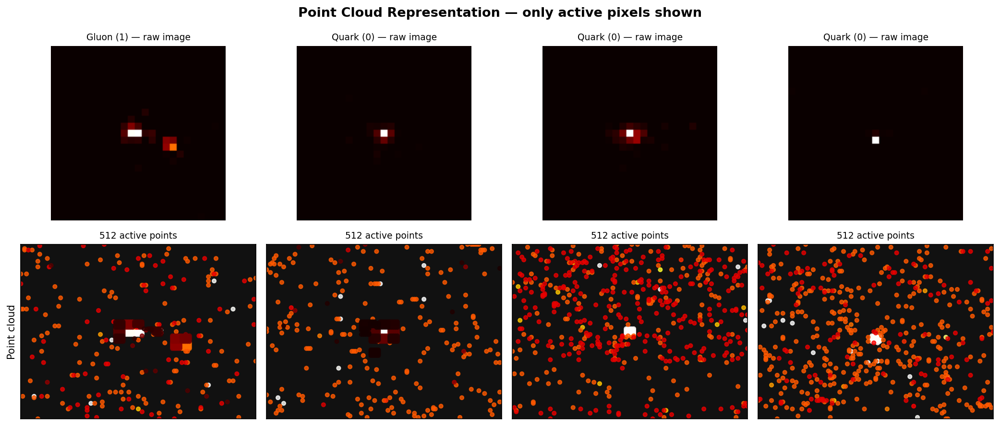
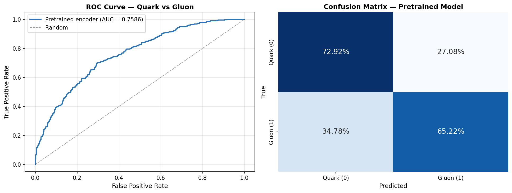
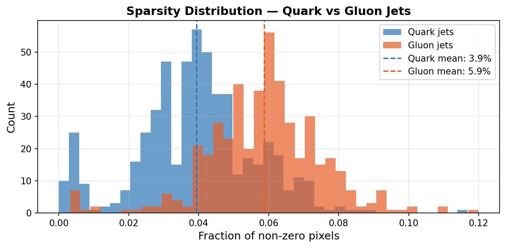
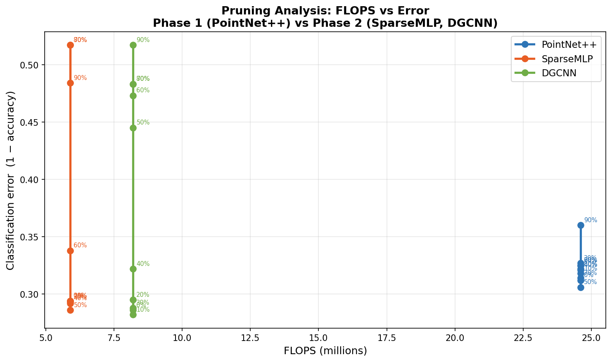
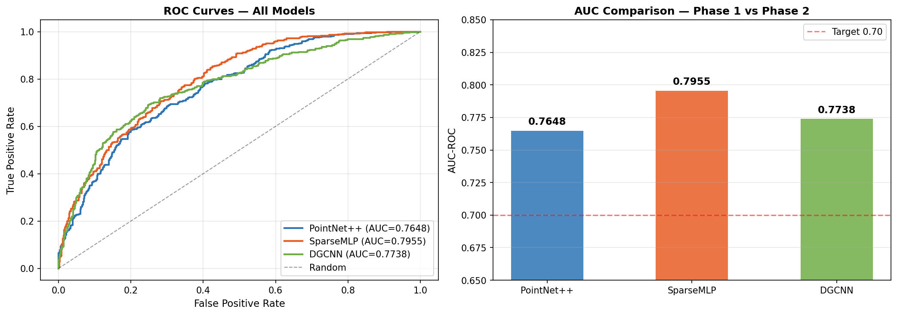
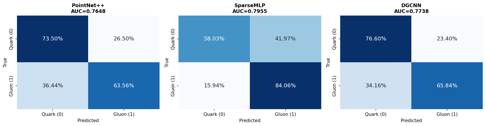

# Sparse Neural Networks for Particle Jet Classification

Efficient point-cloud and graph-based deep learning for high-energy physics image data

**Devarpalli Jahnavi** • [jahhnavvii@gmail.com](mailto:jahhnavvii@gmail.com) • [github.com/jahhnavvii](https://github.com/jahhnavvii)

---

## What's the Problem?

CMS calorimeter images are 125×125 pixels across 8 detector channels. Sounds dense, right? The catch: only about 2-3% of pixels actually carry any energy signal. That means a standard dense neural network wastes 97% of its computation searching through empty space.

At LHC production rates, this isn't a minor inconvenience. It's a real bottleneck. This project tackles it head-on by converting sparse images into point clouds and only processing the pixels that matter.

The result? An architecture that's simultaneously smaller, faster, and more accurate than the dense baseline.

| Model | Test AUC | FLOPS | Improvement |
|---|---|---|---|
| PointNet++ (dense baseline) | 0.765 | 24.6M | baseline |
| **SparseMLP** | **0.796** | **5.9M** | **4.2× fewer FLOPS, +3.9% AUC** |
| DGCNN | 0.774 | 8.2M | 3.0× fewer FLOPS, +1.2% AUC |

The coolest part? SparseMLP at 50% pruning still beats the unpruned dense baseline. It's not just about fewer parameters — the sparse architecture has genuinely better inductive bias for this data.

---

## Why Quadtrees? Why This Design?

Particle jets cluster in small, localized regions. Most of the 125×125 grid is just empty space by physics, not noise. A standard CNN has to search the entire grid to find signal in a tiny corner.

By converting to a point cloud of only active pixels, we cut the input from 125,000 values down to ~900. That's a 140× compression with zero signal loss.

But how should a model actually process that point cloud? I landed on quadtrees: a recursive spatial decomposition that subdivides the image into quadrants and immediately discards empty ones. What's left is a tree whose leaf nodes map exactly onto the jet's energy-carrying regions.

Here's why this feels right: the anti-kt jet clustering algorithm — CMS's standard for jet reconstruction — naturally clusters particles in a hierarchical tree-like way. A quadtree decomposition mirrors that exact structure. The representation and the underlying physics align, which is partly why the sparse models don't just match the dense baseline more cheaply; they actually beat it.

One more detail: I kept channel 1 (track_pT, which captures charged particle momentum) separate instead of collapsing all 8 channels into a single energy map. That one change improved all three models, with DGCNN jumping from 0.707 to 0.774 AUC.

---

## The Data

I worked with simulated CMS calorimeter images:

**Unlabelled:** 60,000 events of shape (60000, 125, 125, 8) in channels-last format. Used for unsupervised pretraining.

**Labelled:** 10,000 events with binary labels (quark = 0, gluon = 1). Used for supervised fine-tuning and evaluation.

Each event is an 8-channel image showing energy deposits and track info across the calorimeter. Channel 4 (the dominant calorimeter layer) averages ~725 active pixels per event, while channel 0 averages only ~45. This huge variance is why you can't just naively collapse channels together.

Physically, gluon jets are "busier" — they activate ~5.9% of pixels on average, compared to ~3.9% for quark jets. This sparsity difference is part of what the models learn to distinguish.

---

## Papers I Built On

**FoldingNet: Point Cloud Auto-encoder via Deep Grid Deformation** (Yang et al., 2018) • [arXiv:1712.07262](https://arxiv.org/abs/1712.07262)

The decoder reconstructs a point cloud by "folding" a fixed 2D grid through learned transformations conditioned on a latent code. I used this as the reconstruction head during unsupervised pretraining. The Chamfer Distance loss teaches the PointNet++ encoder to capture meaningful jet geometry without needing labels.

**Submanifold Sparse Convolutional Networks** (Graham & van der Maaten, 2017) • [arXiv:1706.01307](https://arxiv.org/abs/1706.01307)

This established the core principle: only compute where data exists, don't waste effort on zeros. I couldn't get hardware-level sparse convs (MinkowskiEngine) working due to CUDA incompatibilities, but SparseMLP implements the same principle in pure PyTorch: an MLP applied only to active-pixel coordinates, with multi-scale max-pooling replacing the multi-resolution aggregation of true sparse convolutions.

**PointNet++** (Qi et al., 2017)

The baseline encoder, using Set Abstraction layers to build a hierarchical point cloud representation.

**DGCNN** (Wang et al., 2019)

The second Phase 2 encoder, which builds a k-nearest-neighbour graph and applies edge convolutions, rebuilding the graph in feature space after each layer.

**anti-kt jet clustering** (Cacciari, Salam, Soyez, 2008)

CMS's standard for jet reconstruction. The quadtree decomposition mirrors this hierarchical structure, grounding the design in real physics.

---

## How It Works

### Step 1: Convert Images to Point Clouds

Every 125×125×8 image becomes a point cloud before entering any model. I extract only non-zero pixels and represent each as a 4D point:

```
(row_norm, col_norm, energy_norm, track_pT_norm)
```

Energy is the max across all 8 channels. track_pT is channel 1, kept separate. Everything gets normalized to [0, 1], points are sorted by energy (highest first), and padded to 512 points.



### Step 2: Phase 1 — The Dense Baseline (PointNet++)

First, I pretrained on the 60k unlabelled events using Chamfer Distance loss to reconstruct point clouds. The loss dropped from 0.053 to 0.011 over 50 epochs, showing the encoder learned meaningful structure without labels.

Then I fine-tuned on the 10k labelled events. Early results showed overfitting (val/test AUC gap of ~0.039). I fixed this with BatchNorm, higher dropout (0.3 → 0.5), and data augmentation (random rotation, energy jitter, point dropout). The gap closed to under 0.005.





### Step 3: Phase 2 — Sparse Architectures with Quadtrees

The quadtree recursively subdivides the image and prunes empty quadrants, leaving only jet-dense regions. Two encoders process these:

**SparseMLP:** A three-layer MLP on active-pixel coordinates from the quadtree, with multi-scale max-pooling at each depth.

**DGCNN:** Treats active pixels as graph nodes with dynamic k-nearest-neighbour edges (k=10), rebuilding the graph in feature space after each layer.

Both output a (B, 128) latent vector feeding into a shared classifier head.

### Step 4: Pruning and Efficiency Analysis

I applied global L1 magnitude pruning at ratios from 0% to 90% and tracked FLOPS vs. classification error for all three models.







---

## Engineering Lessons

**1000× training speedup.** Initially, Phase 2 training took 10 minutes per epoch because the quadtree was recomputed for every sample every epoch. I fixed this by pre-computing all point clouds once at dataset initialization. Per-batch time dropped from 5.9 seconds to 0.006 seconds.

**MinkowskiEngine didn't work.** I tried hardware-level sparse convolutions but hit CUDA 12.8 incompatibilities. I reimplemented the sparse operations in pure PyTorch using scatter-based pooling instead, which gives the same mathematical result.

**Environment mess.** On Windows, torch-cluster silently installed into the system Python instead of my conda environment, producing a confusing error. Lesson: always activate your environment explicitly before running anything.

---

## Repository Layout

```
sparse-jet-classification/
├── utils/
│   └── sparse.py                    # image_to_points() conversion
├── datasets/
│   └── jet_dataset.py               # Dataset classes and caching
├── models/
│   ├── pointnet.py                  # PointNet++ encoder
│   ├── autoencoder.py               # FoldingDecoder + pretraining
│   └── classifier.py                # Shared classifier head
├── phase2/
│   ├── quadtree.py                  # Quadtree decomposition
│   ├── sparse_encoder.py            # SparseMLP + DGCNN
│   └── train_hybrid.py              # Phase 2 training
├── notebooks/
│   ├── Phase1_Results.ipynb         # Phase 1 evaluation
│   └── Phase2_Results.ipynb         # Phase 2 evaluation
├── plots/                           # Visualization outputs
├── train_pretrain.py                # Unsupervised pretraining
├── train_finetune.py                # Supervised fine-tuning
└── prune_and_plot.py                # Pruning analysis
```

---

## Getting Started

### Setup

```bash
conda create -n cms_sparse python=3.10
conda activate cms_sparse
pip install torch==2.6.0+cu118 -f https://download.pytorch.org/whl/torch_stable.html
pip install torch-geometric torch-scatter torch-sparse torch-cluster \
    -f https://data.pyg.org/whl/torch-2.6.0+cu118.html
pip install h5py scikit-learn matplotlib seaborn pandas fvcore
```

### Data

Place your datasets here:
```
data/unlabelled/Dataset_Specific_Unlabelled.h5
data/labelled/Dataset_Specific_labelled_full_only_for_2i.h5
```

### Training

```bash
# Pretrain on unlabelled data
python train_pretrain.py --data_dir ./data/unlabelled --epochs 50 --batch_size 32

# Fine-tune the classifier
python train_finetune.py --data_dir ./data/labelled \
    --checkpoint ./checkpoints/encoder_best.pt \
    --epochs 50 --batch_size 16

# Train Phase 2 models
python phase2/train_hybrid.py --model sparse_mlp \
    --data_dir ./data/labelled --epochs 50 --batch_size 16

python phase2/train_hybrid.py --model dgcnn \
    --data_dir ./data/labelled --epochs 50 --batch_size 16

# Run pruning analysis
python prune_and_plot.py
```

### View Results

```bash
jupyter notebook notebooks/Phase1_Results.ipynb
jupyter notebook notebooks/Phase2_Results.ipynb
```

---

## Results

| Metric | Before optimization | After optimization |
|---|---|---|
| Val AUC | 0.777 | 0.791 |
| Test AUC | 0.739 | 0.765 |
| Val/test gap | 0.039 | 0.004 |

Full comparison across all models:

| Model | Test AUC | FLOPS | Notes |
|---|---|---|---|
| PointNet++ (Phase 1) | 0.765 | 24.6M | Dense baseline |
| SparseMLP (Phase 2) | 0.796 | 5.9M | 4.2× fewer FLOPS, higher AUC |
| DGCNN (Phase 2) | 0.774 | 8.2M | 3.0× fewer FLOPS, higher AUC |

---

## What's Next

The DGCNN FLOPS are estimates right now — `fvcore` can't trace dynamic graph operations. Building a custom counter would nail down the comparison.

MinkowskiEngine would unlock true hardware-accelerated sparse convolutions, but the CUDA issues need sorting first.

Multi-class extension (top quark, W boson, QCD) would test whether these efficiency gains generalize beyond binary quark/gluon classification.

---

## Stack

PyTorch 2.6 • PyTorch Geometric • CUDA 12.8 • h5py • scikit-learn • fvcore • Python 3.10

---

## References

[1] B. Graham and L. van der Maaten. *Submanifold Sparse Convolutional Networks*. Facebook AI Research, June 2017. [arXiv:1706.01307](https://arxiv.org/abs/1706.01307)

[2] Y. Yang, C. Feng, Y. Shen, D. Tian. *FoldingNet: Point Cloud Auto-encoder via Deep Grid Deformation*. [arXiv:1712.07262](https://arxiv.org/abs/1712.07262)

[3] M. Andrews, J. Alison, S. An, B. Burkle, S. Gleyzer, M. Narain, M. Paulini, B. Poczos, E. Usai. *End-to-End Jet Classification of Quarks and Gluons with the CMS Open Data*. Carnegie Mellon University, Brown University, University of Alabama, CERN.

---

## Dataset & Acknowledgements

The labelled and unlabelled CMS calorimeter datasets used in this project were provided by [ML4SCI](https://ml4sci.org/) and are publicly available at the [NERSC data portal](https://portal.nersc.gov/cfs/m4392/G25/).

This project began as a task submission for ML4SCI's Google Summer of Code (GSoC) program, and was later restructured and extended into the standalone portfolio project presented here.
